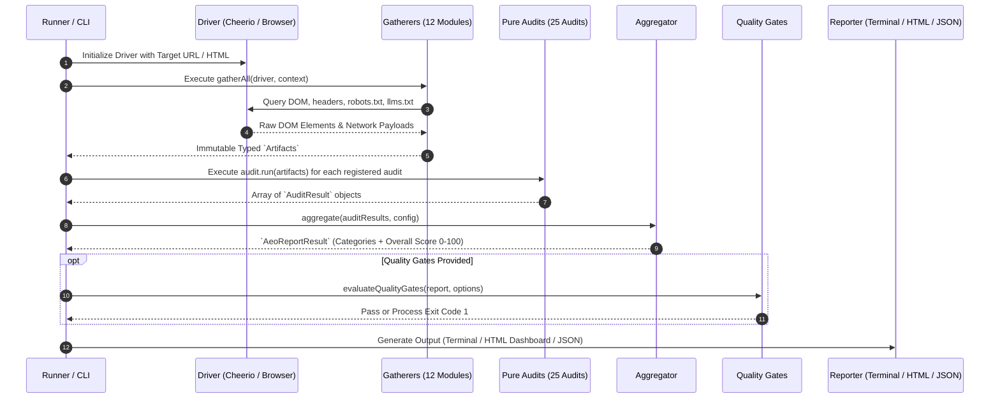

# 🏛️ Spec 01: Architecture & Pipeline Lifecycle

> **Module:** `@drowlink/aeo-linter-core`  
> **Pattern:** Google Lighthouse Architecture  
> **Status:** Production Specification

---

## 1. Architectural Principles

The system strictly adheres to the architectural design patterns established by [Google Chrome Lighthouse](https://github.com/GoogleChrome/lighthouse):

1. **Strict Separation of Concerns**: Data extraction (Gatherers) is strictly decoupled from scoring logic (Audits).
2. **Deterministic & Pure Audits**: Audits do not make network calls, read disk, or mutate the DOM. Consuming identical `Artifacts` will always produce identical `AuditResult` outputs.
3. **Driver Agnosticism**: The engine interacts with the page via a generic `Driver` interface. This allows identical auditing on Node.js/CLI (via Cheerio and HTTP fetch) and inside Google Chrome DevTools / Extension (via native browser DOM and Chrome APIs).
4. **Weighted Categories**: Audits belong to categories, each audit having a local weight, and each category having a global weight contributing to the final score (0 - 100).

---

## 2. Pipeline Execution Sequence



---

## 3. The Driver Abstraction

The `Driver` interface decouples DOM querying and network operations from the engine:

```typescript
export interface Driver {
  getFinalUrl(): Promise<string>;
  getHtml(): Promise<string>;
  querySelector(selector: string): Promise<ElementHandle | null>;
  querySelectorAll(selector: string): Promise<ElementHandle[]>;
  fetchRobotsTxt(): Promise<string | null>;
  fetchLlmsTxt(): Promise<{ llmsTxt: string | null; llmsFullTxt: string | null }>;
  getHttpHeaders(): Promise<Record<string, string>>;
}
```

- **`CheerioDriver`** (`core/src/gather/driver/cheerio-driver.ts`): Used by CLI and Node.js SDK. Parses static HTML using Cheerio, performs native `fetch` requests with configured timeouts and User-Agent headers.
- **Chrome Native Driver** (`extension/engine.js`): Uses `document.querySelector`, `window.location`, and Chrome Extension Network APIs directly inside the inspected tab.

---

## 4. Aggregator Mathematics & Scoring Formula

The aggregation follows Google Lighthouse's weighted normalized formula:

### 4.1 Category Score Calculation

For category $C$ with audit references $A_1, A_2, \dots, A_n$ having weights $w_i$ and audit scores $s_i \in [0, 1]$:

$$\text{CategoryScore}(C) = \text{round}\left(100 \times \frac{\sum_{i=1}^{n} (s_i \times w_i)}{\sum_{i=1}^{n} w_i}\right)$$

*Note:* If an audit produces a score of `null` (e.g. not applicable or informational), its weight is excluded from the denominator.

### 4.2 Overall Score Calculation

The overall AEO score aggregates the 5 category scores $C_1, \dots, C_5$ (each configured with an equal category weight of 20):

$$\text{OverallScore} = \text{round}\left(\frac{\sum_{j=1}^{5} (\text{CategoryScore}(C_j) \times W_{C_j})}{\sum_{j=1}^{5} W_{C_j}}\right)$$

Where $W_{C_j} = 20$ for all 5 categories, resulting in equal 20% distribution.

---

## 5. Quality Gates & Assertions

Implemented in `core/src/runner/assertions.ts`:

- `--fail-under <N>`: Verifies `report.score >= N`. If the total score is less than $N$, an error is emitted and process exits with code `1`.
- `--assert-category <category:threshold>`: Supports multiple assertions (e.g. `--assert-category seo-fundamentals:85 --assert-category ai-accessibility:90`).
- Return format:
  ```typescript
  export interface QualityGateEvaluation {
    passed: boolean;
    failures: Array<{
      target: 'overall' | 'category';
      category?: string;
      expected: number;
      actual: number;
      message: string;
    }>;
  }
  ```

---

## 6. Reporters

1. **`TerminalReporter`**: Outputs styled ANSI tables, category summary cards, emoji health indicators, and top keyword density summaries directly to stdout.
2. **`HtmlReporter`**: Generates a self-contained single-file HTML document (zero external CDN or runtime JS dependencies) containing circular SVG score gauges, interactive collapsible diagnostics, SERP snippet simulator, and keyword density matrix.
3. **Raw JSON**: Produces typed `AeoReportResult` for CI/CD artifact storage and robotic ingestion.
